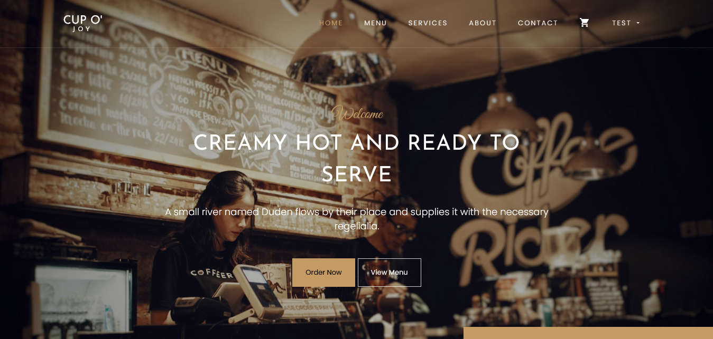
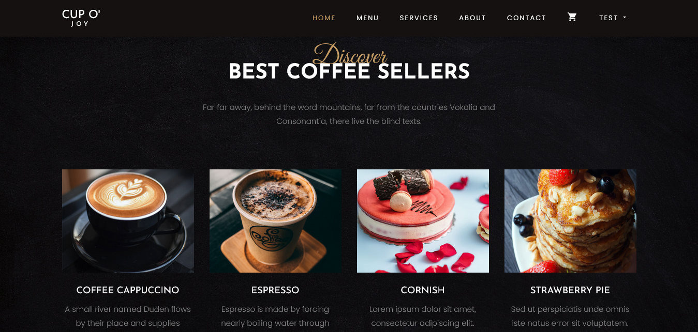
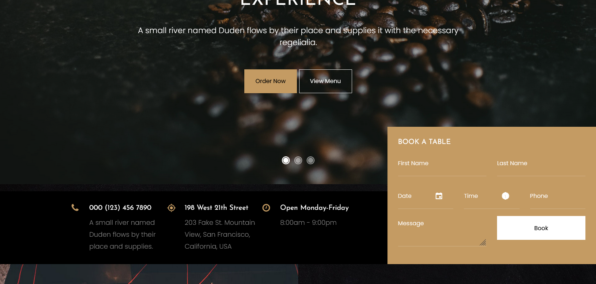
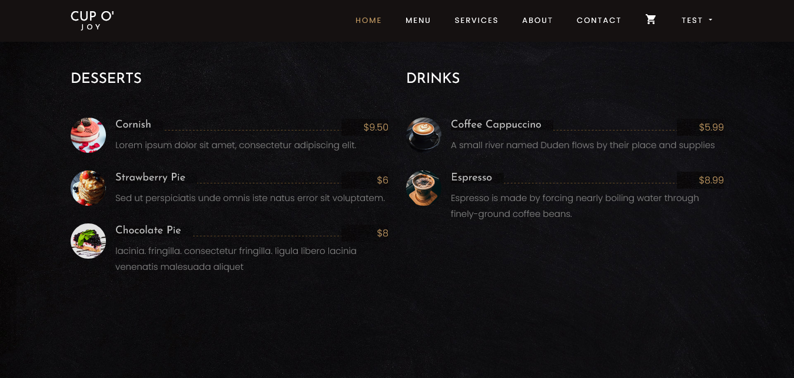
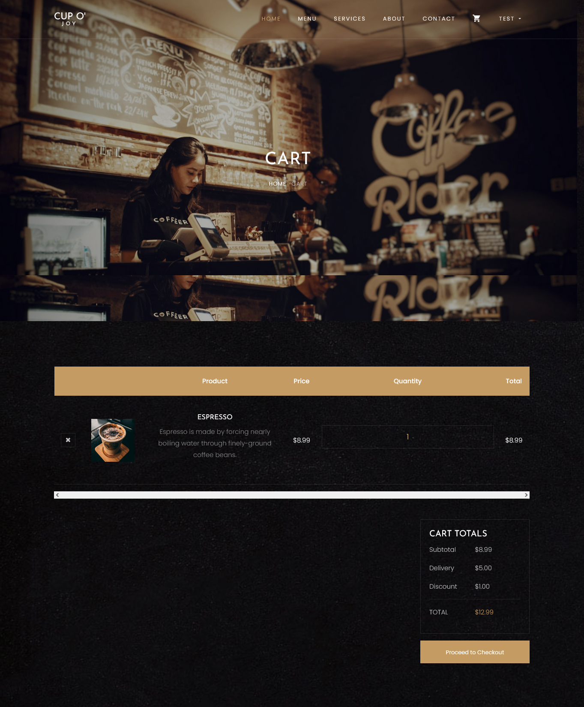
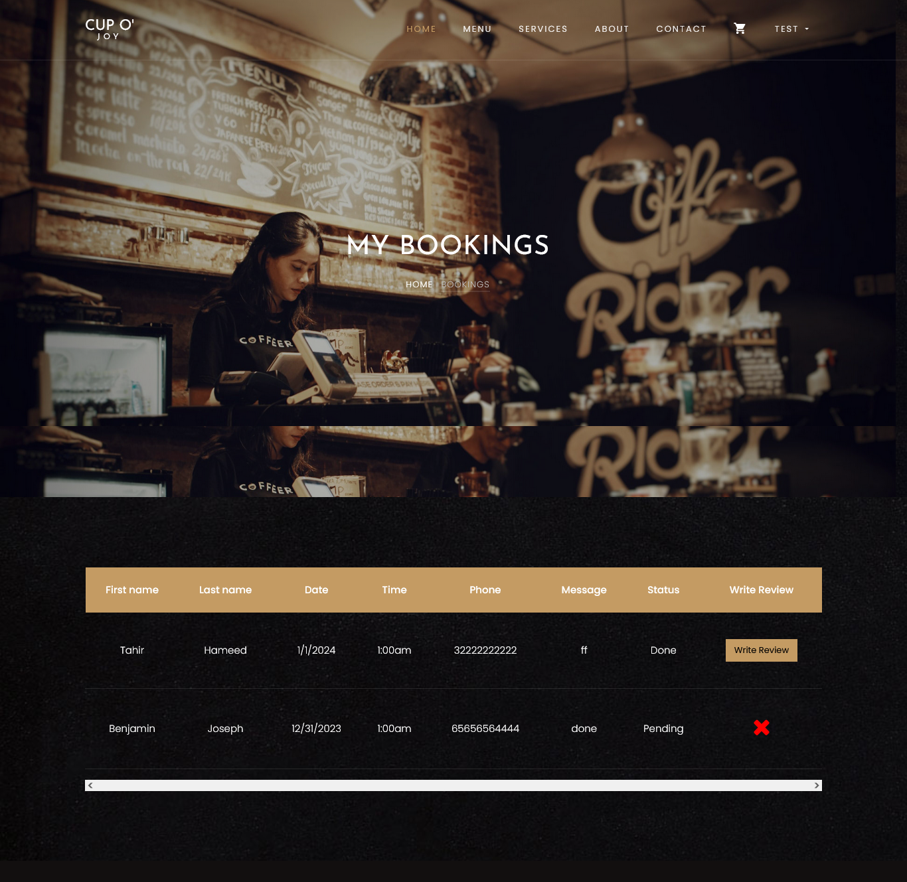
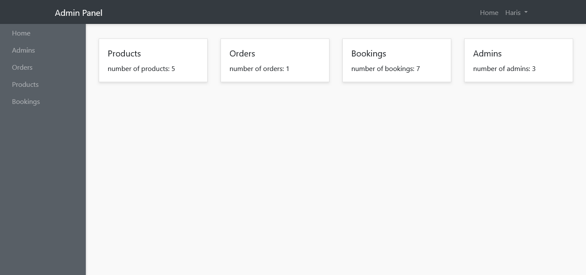

# CoffeeShop Website with AdminPanel

# Setup:
1. Install Xampp local server.
2. Edit the config file.
3. Add your Database, username and password.
4. Go to browser and open in localhost.
--------------------------------------------------------------------

# Coffee Website Images

--------------------------------------------------------------------

--------------------------------------------------------------------

--------------------------------------------------------------------

--------------------------------------------------------------------

--------------------------------------------------------------------

--------------------------------------------------------------------

# Admin Panel

